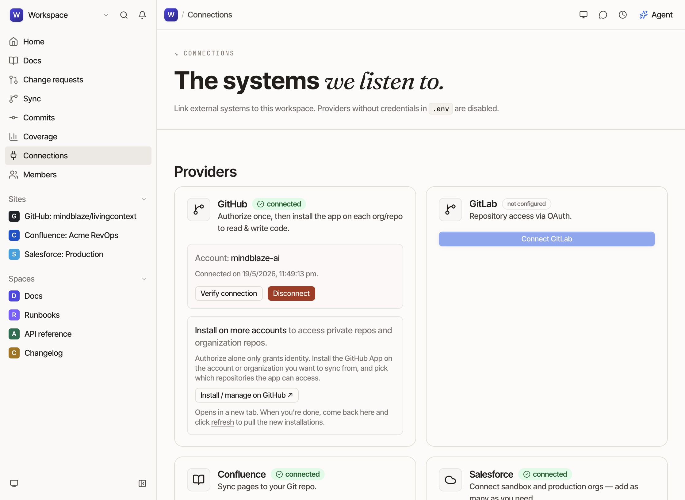
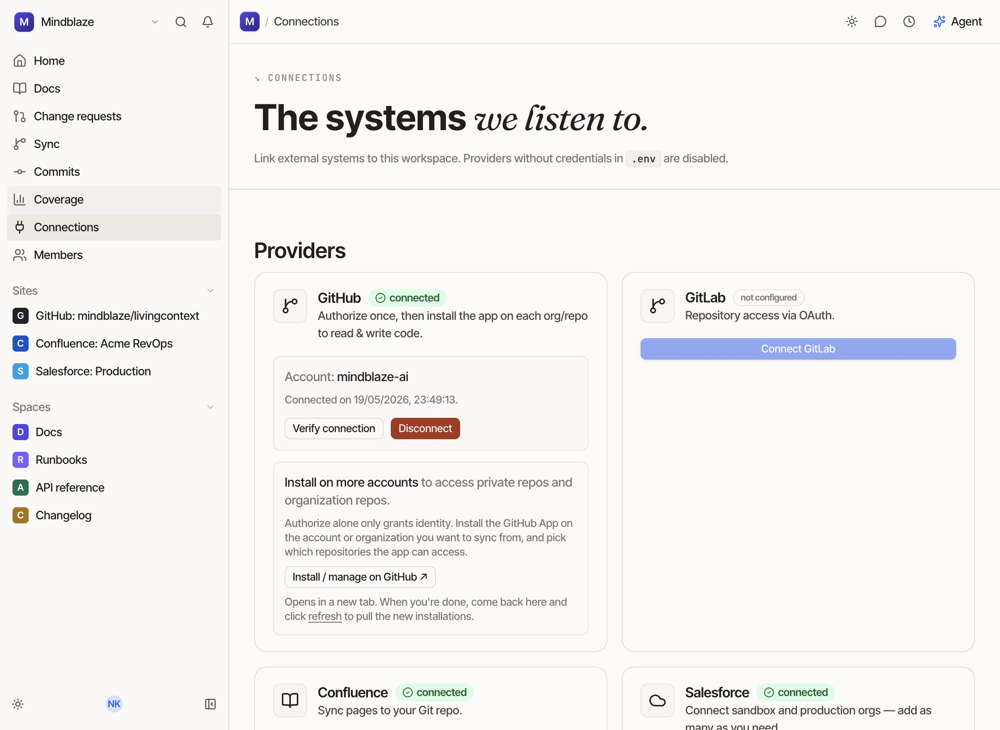
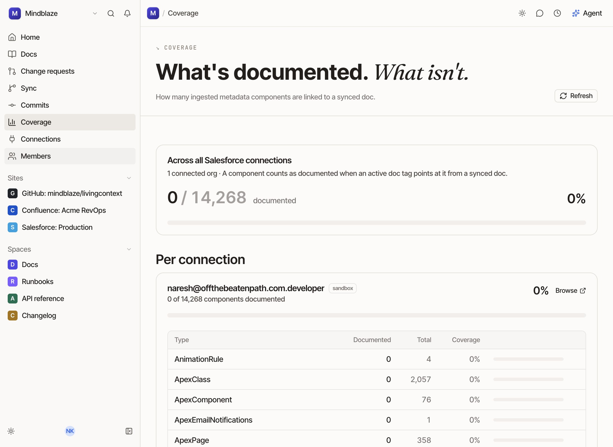
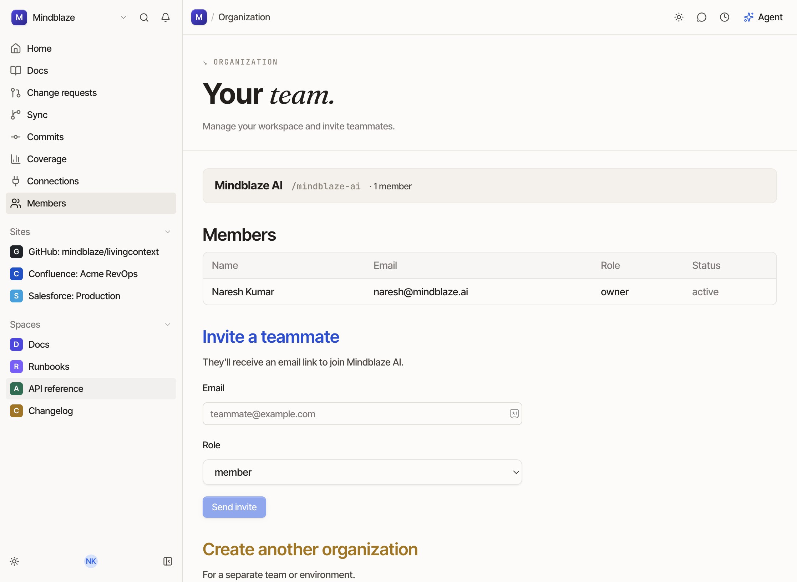

# Navigate to AAPI Reference in LivingContext

### Step 1

Click anywhere on the page to dismiss any open menus or dialogs.

### Step 2

Click the **Coverage** link in the workspace rail.

### Step 3

Click the **Members** link in the workspace rail.

### Step 4

Click the **AAPI reference** link in the workspace rail.

