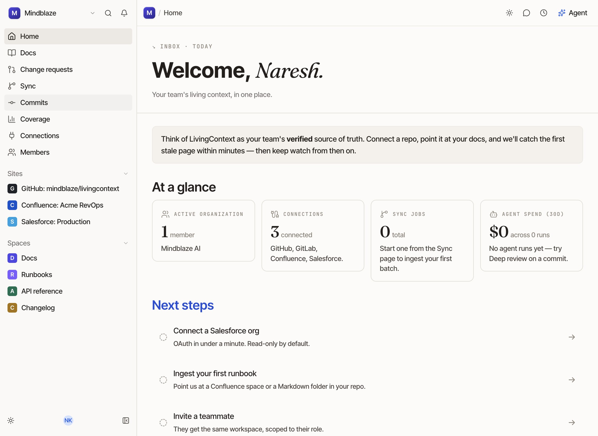
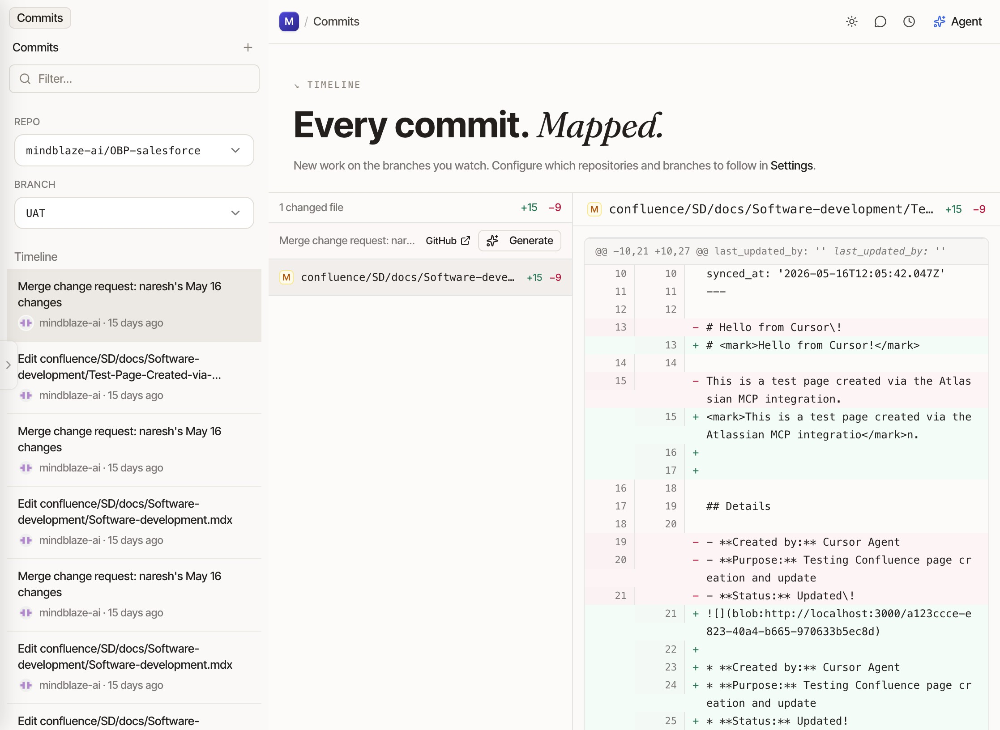
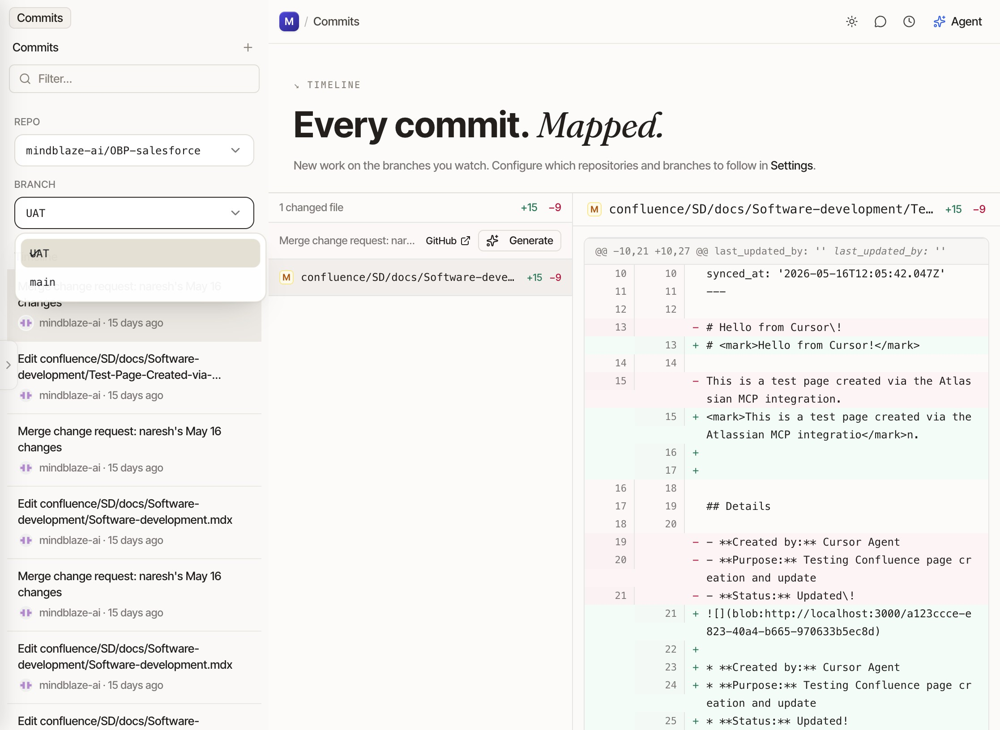
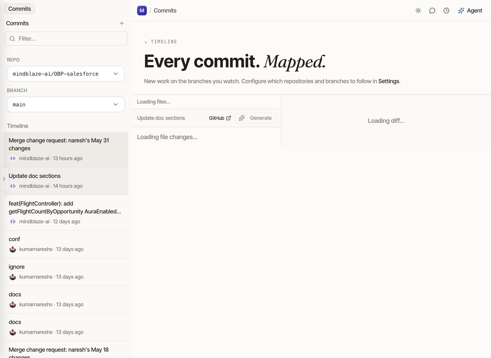
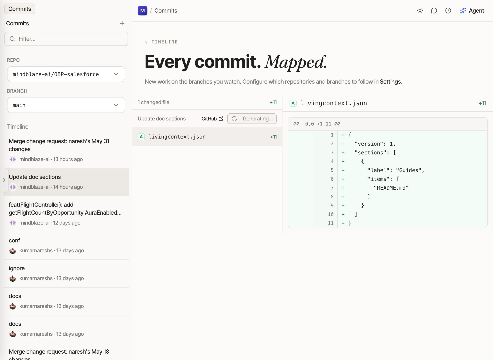

# View and Process Commits in LivingContext

### Step 1

Click the **Commits** link in the workspace rail.

### Step 2

Click the **Repomindblaze-ai/OBP-salesforceBranchUAT** repository option in the sidebar.

### Step 3

Click anywhere on the page to refresh or interact with the commits view.

### Step 4

Click the **Update doc sections** commit button.

### Step 5

Click the **Generating…** button to start the commit mapping process.

